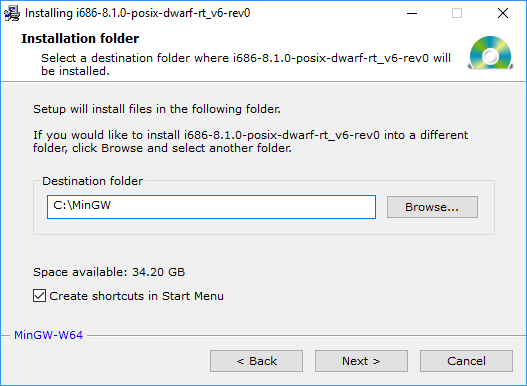

# ICIE Windows guide

## How to install MinGW (the C++ compiler toolchain)?

1. Go to the [mingw-builds downloads page](http://mingw-w64.org/doku.php/download/mingw-builds), and click "Sourceforce" to download.
2. On the setup settings screen, leave all options as defaults. 
3. On the destination folder screen, set the destination folder to "C:\MinGW". 

*Did you have any issues, or don't understand something? Please create an issue on the [issues page](https://github.com/pustaczek/icie/issues)!*

*See the [README](https://github.com/pustaczek/icie#icie----) to learn how to use ICIE.*
